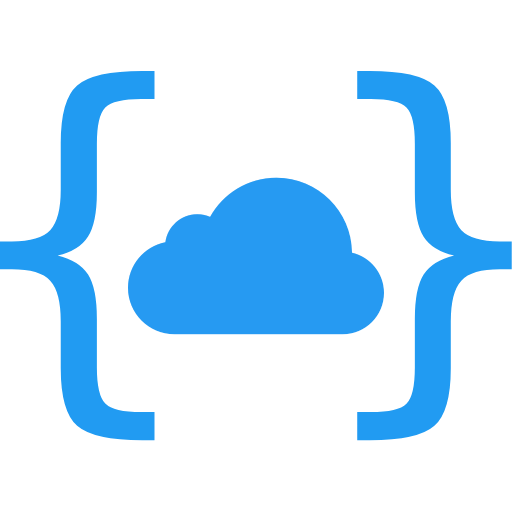

<div align="center">
	
	<h1>nameSpace</h1>
	<p>Открытая облачная платформа</p>
</div>

## О проекте

nameSpace - открытая облачная платформа для локальной сети. Она позволяет запустить свой сервер
и передавать файлы между устройствами, подключёнными к одной сети.

## Установка

Склонируйте репозиторий и соберите проект

```shell
git clone https://github.com/shelepuginivan/namespace-server.git

cd namespace-server
npm ci
npm run build
```

Для запуска сервера

```shell
npm run start:prod
```

Перед запуском, убедитесь, что у вас настроен конфиг-файл.

```shell
cd config
mv example.json default.json
vim default.json
```

## Клиент
Для работы с облаком также необходим клиент. В качестве клиента могут выступать две программы:

1. Браузерный клиент (PWA)
2. Консольный интерфейс

### 1. Браузерный клиент

Браузерный клиент можно запустить при помощи системы сборки (Vite), утилиты live-server, или поставить на хостинг: Netlify, Vercel, GH Pages и т.д.

Обратите внимание, что для корректной работы облачного клиента необходим протокол `http`, `https` требует настройки
SSL-сертификата на стороне сервера. Это правило не относится к локальному хосту (`localhost` или `127.0.0.1`).

Инструкция по настройке и запуску веб-клиента находится в его
[репозитории](https://github.com/shelepuginivan/namespace-client)

### 2. CLI-клиент

Этот клиент позволяет взаимодействовать с файловой системой прямо из терминала.
Для запуска не требуются никакие сторонние утилиты.

Подробную инструкцию по установке и запуску вы можете найти в репозитории
[консольного клиента](https://github.com/shelepuginivan/namespace-client-cli)

### Другие клиенты

В дальнейшем возможен выход десктоп-клиента на платформе `Electron.js` или `Tauri`,
а также мобильного приложения на `React Native`.
